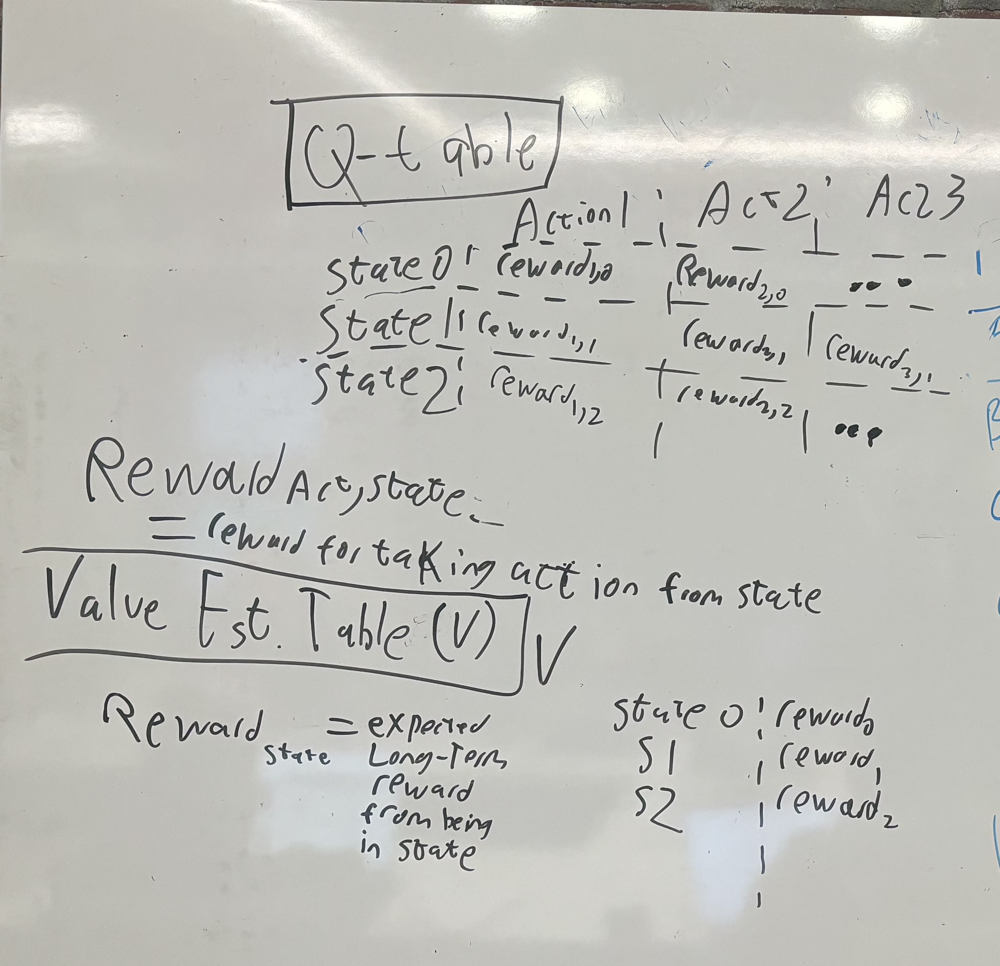

# Temporal Difference

## Resources

[RL Course by David Silver - Lecture 4: Model-Free Prediction](https://www.youtube.com/watch?v=PnHCvfgC_ZA)

[RL Course by David Silver - Lecture 5: Model Free Control](https://www.youtube.com/watch?v=0g4j2k_Ggc4&list=PLqYmG7hTraZDM-OYHWgPebj2MfCFzFObQ&index=6)

[Simple Reinforcement Learning: Temporal Difference Learning
](https://medium.com/@violante.andre/simple-reinforcement-learning-temporal-difference-learning-e883ea0d65b0) (medium member only)

[On-Policy TD control methods](https://paperswithcode.com/methods/category/on-policy-td-control)

### [Monte Carlo Policy evaluation](https://www.geeksforgeeks.org/monte-carlo-policy-evaluation/)

Evaluation Paent formula

* 
  * `V` is "value" of state `s` under policy `π`.
  * `G` = average return of that state `s` using that policy.
  * `N(s)` = number of times state `s` is visited during episode.
  * return is `V(s)` value of that state `s`

That is the general logic we'll be following to create the monte carlo policy evaluation.

## General background and terms

`V` = value estimate = value estimate table

`policy` = π = policy function.
* the contents of `policy` are not relevant for the calculations we'll be performing here, as our job is to evaluate the ersults that policy created.

## Task 1 - TD(λ)

Value Function Update: The value function estimate V(s) is updated for all states s according to the following rule:

V(s) = V(s) + α * δ * e(s)

where α is the learning rate, and δ is the TD error, defined as:

`δ = r + γ * V(s') - V(s)`

* `δ` = delta = TD error
* `r` = reward
* `γ` = gamma = discount factor
* `V(s')` = estimated value of next state
  * this is what we already have stored at the time.
  * I believe this is before we've actually updated that section of the V table
* `V(s)` = estimated value of current state
  * is this simply using the value we already have too?
    * and hten we update it based on error function?
