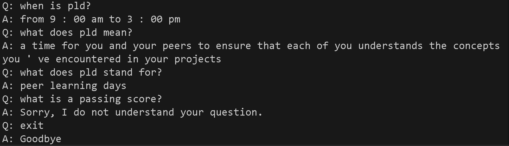

# QA Bot

This question and answer bot will ask for questions and answer with an answer. It'll also exit when told things like `"bye"` ☆

It pulls information from [a stack of Zendesk articles](./data/ZendeskArticles/) outlining Holberton School's curriculum rules and answers questions about it. Questions that cannot be answered are answered with `Sorry, I do not understand your question.`

Running the `2-main.py` file preps the QA Bot with the Peer Learning Days article, and `2-main_all.py` uses multiple articles, allowing broader coverage, but reduced precision.

